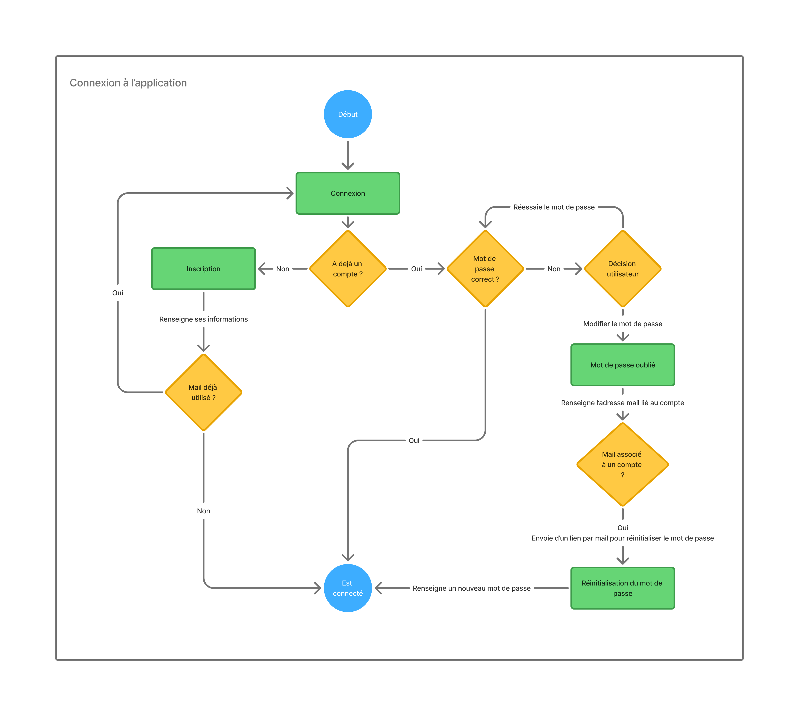
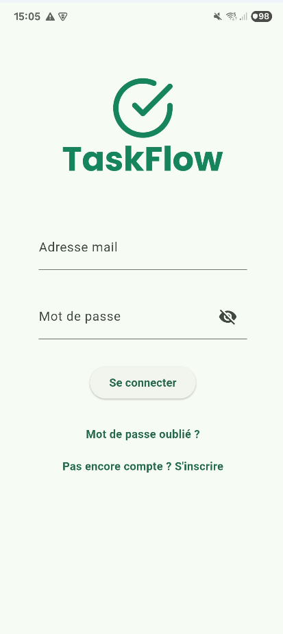
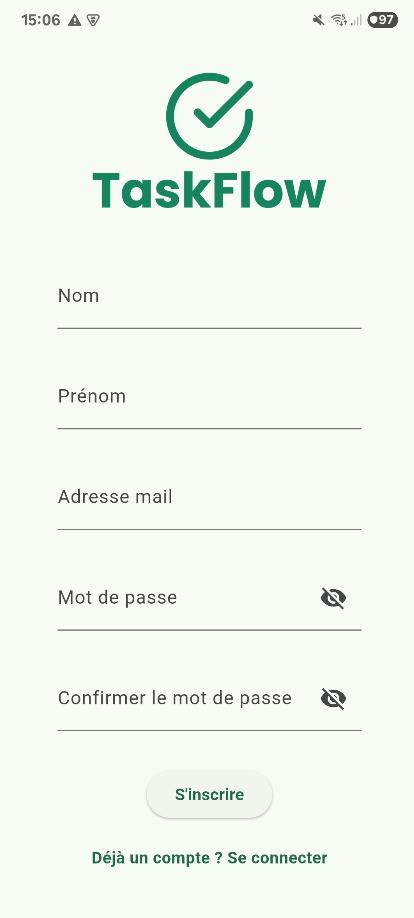
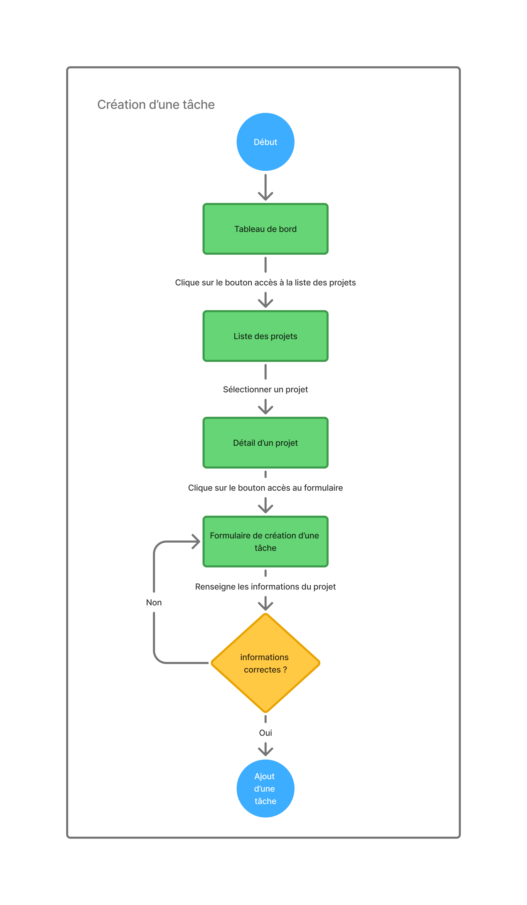
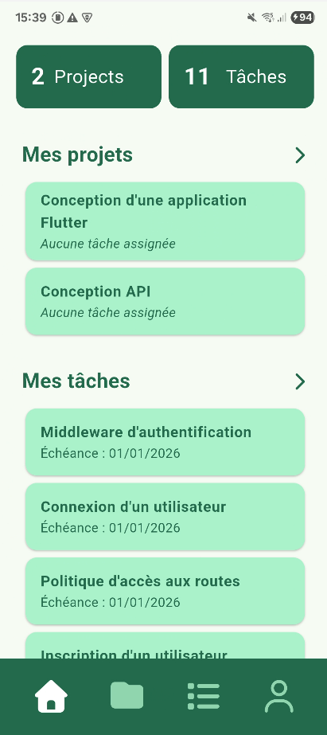
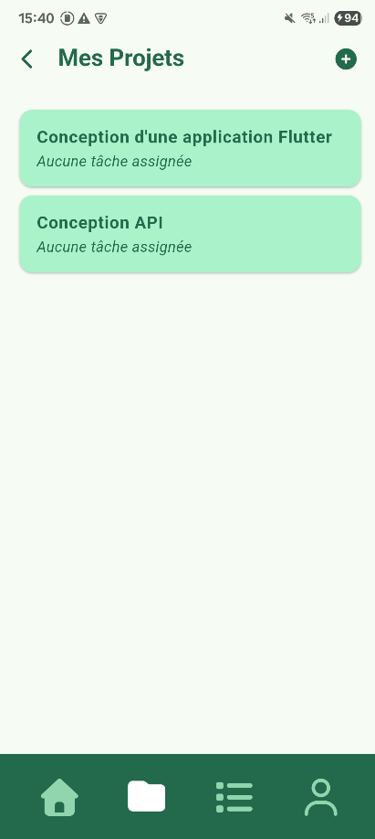
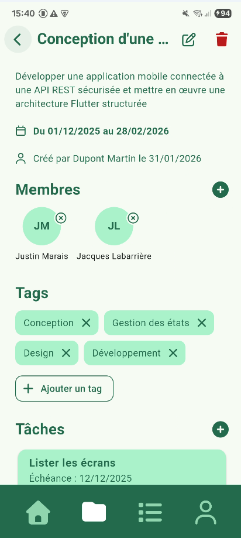
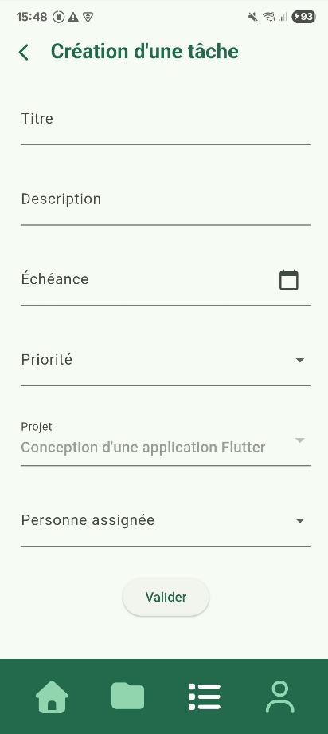

# Documentation Technique - Architecture

Cette documentation décrit l’architecture de l’application **TaskFlow**, les choix techniques, la navigation, la gestion d’état et les aspects de sécurité.

**Technologies utilisées :**
- Flutter 3.38.1
- Dart 3.10.0
- Riverpod pour la gestion d’état
- Navigator pour la navigation
- API REST/Node.js pour le back-end
- Flutter Secure Storage pour les données sensibles (token)

---

## 🧱 Structure du projet

lib/
├─ enums/ # Enumérations
├─ models/ # Modèles de données (Project, Task, User, etc.)
├─ providers/ # Providers Riverpod
├─ views/ # Écrans/pages de l'application
├─ widgets/ # Widgets réutilisables
├─ services/ # Services API et logique métier
├─ utils/ # Fonctions utilitaires

**Exemples :**
- `models/project_light.dart` → structure simple d'un projet
- `views/project_detail.dart` → écran détail projet
- `widgets/card_project.dart` → composant réutilisable pour afficher les informations d'un projet dans le contexte d'une liste de projets
- `services/api/data/project_service.dart` → appels aux endpoints /projects du backend

---

## ⤵️ Navigation

Présentation de quelques user flow et écrans.

### 🔐 Connexion / Inscription

**User flow de connexion à l'application**


**Écran de connexion et d'inscription**




### ▶️ Consultation des informations et ajout d'une tâche

**User flow de création d'une tâche**


**Écran d'accueil › Liste des projets › Détail d'un projet › Formulaire de création d'une tâche**









---

## 🔖 Gestion d’état

L’application utilise Riverpod pour la gestion globale de l’état.

Providers principaux :

• auth_provider → gère l'authentification de l’utilisateur et la mise à jour de ses informations
• user_provider → informations de l’utilisateur connecté
• users_providers → liste des utilisteurs enregristrés sur l'application
• tasks_list_provider → liste des tâches et des filtres/tri associés

---

## 🔒 Sécurité

Le token JWT de l'utilisateur connecté est stocké dans FlutterSecureStorage.
L’authentification se fait via API : route api/users/login → récupération du token JWT des informations de l'utilisateur (id, nom, prénom, mail et rôles).
Le package Dio est utilisé our faires les appels vers l'API. La classe DioClient gère les headers et l'ajout du token.
Les services API sont centralisés dans services/api.

---

## 🧪 Tests

Les tests sont regroupés dans le dossier tests :

• integration → concerne les tests d'intégration vers l'API (version Mock)
• unit → concerne les tests unitaires sur les providers
• widget → concerne les tests sur les widgets (leurs rendus, interactions et états)

Exécuter tous les tests :
```bash
flutter test
```

Générer un rapport de couverture :
```bash
genhtml.bat coverage/lcov.info -o coverage/html
```

---

📅 **Dernière mise à jour :** 31/01/2026
